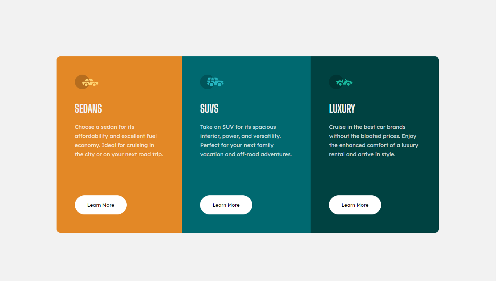
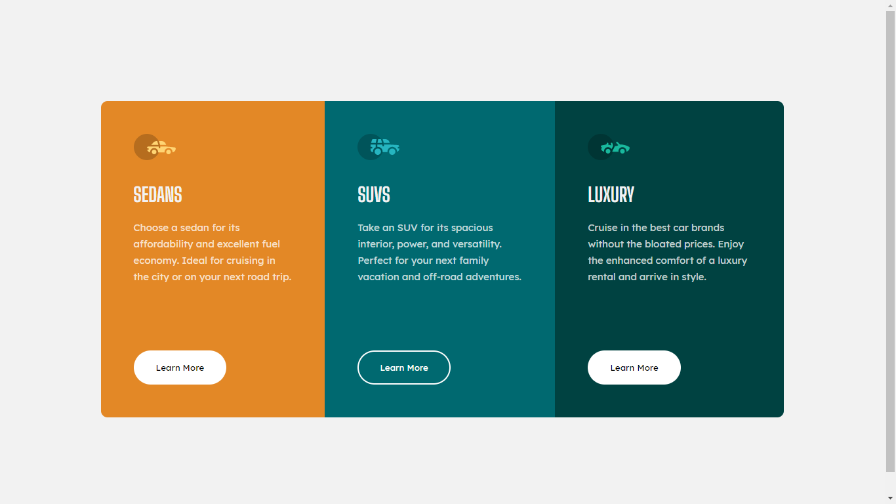
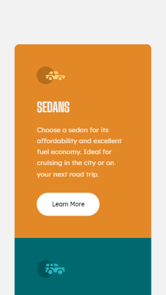
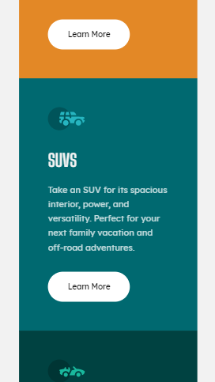
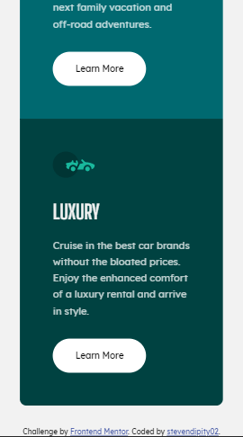

# Frontend Mentor - 3-column preview card component solution

This is a solution to the [3-column preview card component challenge on Frontend Mentor](https://www.frontendmentor.io/challenges/3column-preview-card-component-pH92eAR2-). Frontend Mentor challenges help you improve your coding skills by building realistic projects. 

## Table of contents

- [Overview](#overview)
  - [The challenge](#the-challenge)
  - [Screenshot](#screenshot)
  - [Links](#links)
  - [Built with](#built-with)
  - [What I learned](#what-i-learned)
  - [Continued development](#continued-development)
  - [Useful resources](#useful-resources)
- [Author](#author)

## Overview

### The challenge

Users should be able to:

- View the optimal layout depending on their device's screen size
- See hover states for interactive elements

### Screenshot

### Links

- Solution URL: (https://github.com/stevendipity02/3-column-preview-card-component-main.git)
- Live Site URL: [Add live site URL here](https://stevenbanilbo.github.io)

## My process

### Built with

- Semantic HTML5 markup
- CSS custom properties
- Flexbox

### What I learned

I should've focused on the content inside the boxes/cards first rather than starting from the layout that could've shorten my time in finishing the project.

### Continued development

Flexbox and proper sizing adjustments

### Useful resources

- https://www.w3schools.com/css/css3_flexbox_container.asp - This helped me in using flexbox properties properly

## Author

- Website - [Steven Banilbo](https://stevenbanilbo.github.io)
- Frontend Mentor - [@yourusername](https://www.frontendmentor.io/profile/stevendipity02)
